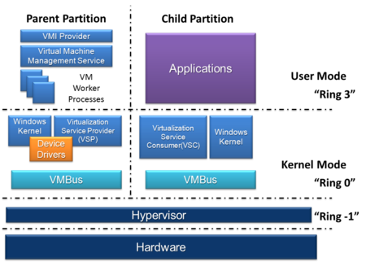

# Hypervisors
## What is a hypervisor
A hypervisor enables creating and running virtual machines. This means you can put lots of people on a single machine in an isolated manner which lowers CoGs in a cloud perspective.
* Host Machine - A machine running a hypervisor standing up VMs 
* Guest Machine - Each VM running on a host 

A single host can run multiple guests with different OS flavors, meaning you can have a Linux, Windows, and OS X instance running on one x86 machine.

### Types of hypervisors 
1. Type-1: Native / Bare-metal
  * Runs directly on host hardware to control hardware and manage guests 
  * Hyper-V, Xen, Citrix XenServer, VMWare ESX
2. Type-2: Hosted
  * Run on an OS like any other program would. Guest OS runs as a process on the host.
  * VirtualBox, QEMU

## Hyper-V
Codenamed Viridian, this native hypervisor creates virtual machines on x86-64 systems running Windows.
A server running hyper-v enables configuration to expose individual VMs to one or many networks.

Isolation of VMs is offered through **partitions**.
* **Child Partition** - a logical unit of isolation where each guest OS executes
* **Parent Partition** - a logical unit of isolation where the virutalization stack runs

Each child cannot access the physical processor, nor can it handle real interrupts. It has a view of the processor and runs in Guest Virtual ADdress.
Hyper-V can choose a subset of processors to expose to each partition. Using a logical Synthetic Interrupt Controller, hyper-v is able to route interrupts to the correct partition.

Child partitions get a virtual view of resoruces. Requests from children are redirected via the **VMBus** to devices in parent partitions. If parents are also virtual devices, this recursively occurs until the parent partition with physical access is found.

## Competitors
* Xen
* VirtualBox
* OpenStack
* KVM
* VMware
* Citrix

## Read more
[Technet Hyper-V Doc](https://technet.microsoft.com/en-us/library/mt169373(v=ws.11).aspx)